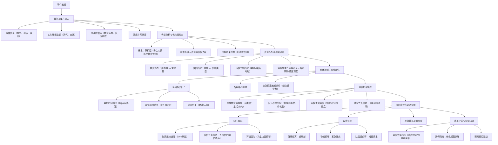

```mermaid
graph TD
    A[事件触发] --> B[数据采集与输入]
    B --> B1[事件信息（类型、地点、级别）]
    B --> B2[实时环境数据（天气、交通）]
    B --> B3[资源数据库（物资库存、队伍状态）]
    B --> B4[法规与预案库]
    B --> C[需求分析与优先级判定]
    C --> C1[需求计算模型（伤亡人数→医疗物资需求）]
    C --> C2[事件等级→资源调度优先级]
    C --> C3[法规约束检查（如调拨权限）]
    C --> D[资源匹配与冲突消解]
    D --> D1[物资匹配：库存量 vs 需求量]
    D --> D2[队伍匹配：技能 vs 任务类型]
    D --> D3[运输工具匹配（载重/速度/地形）]
    D --> D4[冲突处理：库存不足→外部采购/跨区调配]
    D --> E[路径规划与风险评估]
    E --> E1[多目标优化：]
    E1 --> E1a[最短时间路径（Dijkstra算法）]
    E1 --> E1b[最低风险路径（避开塌方区）]
    E1 --> E1c[成本约束（燃油/人力）]
    E --> E2[备用路线生成]
    E --> E3[应急预案触发条件（如交通中断）]
    E --> F[调度指令生成]
    F --> F1[生成物资调拨单（品类/数量/目的地）]
    F --> F2[队伍任务分配（救援区域/协作机制）]
    F --> F3[运输工具调度（车牌号/司机信息）]
    F --> F4[时间节点绑定（最晚到达时间）]
    F --> G[执行监控与动态调整]
    G --> G1[实时追踪：]
    G1 --> G1a[物资运输进度（GPS轨迹）]
    G1 --> G1b[队伍任务状态（人员伤亡/装备损耗）]
    G1 --> G1c[环境变化（次生灾害预警）]
    G --> G2[异常处理：]
    G2 --> G2a[路线偏离→重规划]
    G2 --> G2b[物资损坏→紧急补充]
    G2 --> G2c[队伍超负荷→增援请求]
    G --> G3[反馈数据更新图谱]
    G --> H[效果评估与知识沉淀]
    H --> H1[调度效率指标（响应时间/资源利用率）]
    H --> H2[案例归档→优化模型训练]
    H --> H3[预案修订建议]
```